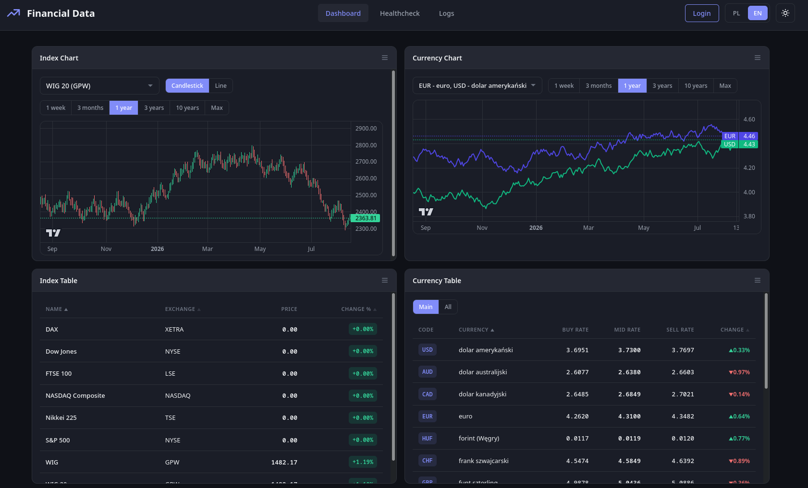

<h1 align="center">📈 FinancialData</h1>

Full-stack platform for collecting, processing, and visualizing financial market data from 
<b>NBP API</b> (currency exchange rates) and <b>Yahoo Finance</b> (global stock market data).

---

<h2>Screenshots<h2>

<h3>Dashboard</h3>

<h2>🚀 Features</h2>

<h3>Backend</h3>

<ul>
  <li>REST API built with <b>FastAPI</b> (25+ endpoints)</li>
  <li>Currency exchange rates from <b>NBP API</b> (tables A, B, C — mid, buy, sell)</li>
  <li>Global stock market data via <b>Yahoo Finance</b> (50+ exchanges, 40+ indices)</li>
  <li>Async PostgreSQL database with <b>SQLAlchemy</b> and <b>Alembic</b> migrations</li>
  <li>Scheduled NBP data sync with <b>APScheduler</b> (Mon–Fri)</li>
  <li>Historical data bulk loading with rate limiting and <b>Parquet-based</b> fetch tracking</li>
  <li>Data health monitoring and staleness detection</li>
  <li>Structured JSON logging with <b>structlog</b></li>
  <li>HTTP client with retries via <b>httpx</b></li>
  <li>Seed data for stock exchanges, indices, and companies (JSON / YAML)</li>
</ul>

<h3>Frontend</h3>

<ul>
  <li>Interactive dashboard with draggable and resizable tiles (<b>react-grid-layout</b>)</li>
  <li>Financial charts powered by <b>TradingView lightweight-charts</b></li>
  <li>Currency, index, and stock price tables with filtering and period selection</li>
  <li>Data health monitoring page</li>
  <li>Application log viewer with filtering, sorting, and pagination</li>
  <li>Raw OHLCV data browser</li>
  <li>Dark / light theme with system preference detection</li>
  <li>Internationalization (English / Polish) via <b>i18next</b></li>
  <li>Mock mode for frontend development without backend</li>
</ul>

<h3>Infrastructure</h3>

<ul>
  <li>3-service Docker Compose setup (backend, frontend, PostgreSQL)</li>
  <li>Automated database migrations on startup</li>
  <li>Makefile for common development tasks</li>
</ul>

---

<h2>🛠 Technologies</h2>

<h3>Backend</h3>

<ul>
  <li>Python 3.14</li>
  <li>FastAPI + Uvicorn</li>
  <li>SQLAlchemy (async) + asyncpg</li>
  <li>Alembic (migrations)</li>
  <li>PostgreSQL 16</li>
  <li>httpx (async HTTP client with retries)</li>
  <li>yfinance (Yahoo Finance data)</li>
  <li>pandas + pyarrow + numpy</li>
  <li>APScheduler (cron jobs)</li>
  <li>Pydantic + pydantic-settings</li>
  <li>structlog (structured logging)</li>
  <li>Ruff (linting + formatting), mypy (type checking)</li>
  <li>pytest + pytest-asyncio (testing)</li>
</ul>

<h3>Frontend</h3>

<ul>
  <li>React 19 + TypeScript</li>
  <li>Vite (build tool)</li>
  <li>react-router-dom (routing)</li>
  <li>@tanstack/react-query (data fetching)</li>
  <li>axios (HTTP client)</li>
  <li>lightweight-charts (TradingView)</li>
  <li>react-grid-layout (dashboard layout)</li>
  <li>styled-components (styling)</li>
  <li>i18next (internationalization)</li>
  <li>Vitest + Testing Library (testing)</li>
</ul>

---

<h2>🏗 Architecture</h2>

<pre>
┌─────────────┐     ┌─────────────┐     ┌─────────────┐
│  Frontend   │────▶│  Backend    │────▶│ PostgreSQL  │
│  React/TS   │     │  FastAPI    │     │   16        │
│  :5173      │     │  :8000      │     │   :5432     │
└─────────────┘     └──────┬──────┘     └─────────────┘
                           │
                    ┌──────┴──────┐
                    │             │
               ┌────▼────┐  ┌────▼─────┐
               │ NBP API │  │ Yahoo    │
               │         │  │ Finance  │
               └─────────┘  └──────────┘
</pre>

---

<h2>📊 Data Sources</h2>

<h3>NBP API (exchange rates)</h3>

<ul>
  <li><b>Table A</b> — mid rates for major currencies (EUR, USD, GBP, CHF, JPY, ...)</li>
  <li><b>Table B</b> — mid rates for less common currencies</li>
  <li><b>Table C</b> — buy and sell rates</li>
</ul>

<h3>Yahoo Finance (stocks & indices)</h3>

<ul>
  <li><b>50+ stock exchanges</b> — NYSE, NASDAQ, GPW, LSE, XETRA, TSE, HKEX, SIX, EPA, ...</li>
  <li><b>40+ stock indices</b> — WIG20, S&P 500, DAX, FTSE 100, Nikkei 225, ...</li>
  <li><b>Stock companies</b> — OHLCV data for individual tickers across global exchanges</li>
</ul>

---

<h2>⚙️ Installation & Running</h2>

Clone the repository:

<pre>
git clone https://github.com/adam-91/FinancialData.git
cd FinancialData
</pre>

Start all services with Docker Compose:

<pre>
docker compose up -d
</pre>

This starts 3 services:

<ul>
  <li><b>Backend API</b> — <code>http://localhost:8000</code></li>
  <li><b>Frontend</b> — <code>http://localhost:5173</code></li>
  <li><b>PostgreSQL</b> — <code>localhost:5432</code></li>
</ul>

On startup the backend automatically:

<ol>
  <li>Runs database migrations (Alembic)</li>
  <li>Seeds stock exchanges and indices from YAML configs</li>
  <li>Syncs NBP exchange rate tables (A, B, C)</li>
  <li>Imports stock companies if below threshold</li>
  <li>Fetches historical data from Yahoo Finance</li>
  <li>Starts the scheduler for daily NBP sync</li>
</ol>

---

<h2>▶️ Local Development</h2>

<h3>Backend</h3>

<pre>
# Install dependencies
pip install -r app/requirements.txt

# Run the backend
uvicorn app.main:app --reload --port 8000
</pre>

<h3>Frontend</h3>

<pre>
cd frontend
npm install
npm run dev
</pre>

<h3>Makefile commands</h3>

<pre>
make up          # Start all Docker services
make down        # Stop all Docker services
make logs        # View container logs
make backend     # Open shell in backend container

make format      # Format code with Ruff
make lint        # Lint code with Ruff
make fix         # Auto-fix lint issues
make typecheck   # Type check with mypy
make test        # Run tests with pytest
make cov         # Run tests with coverage
make check       # Run lint + typecheck + tests
</pre>

---

<h2>🌐 API Endpoints</h2>

<h3>Currencies</h3>

<ul>
  <li><code>GET /api/currencies/</code> — list all currencies</li>
  <li><code>GET /api/currencies/{code}/history?period=</code> — currency rate history</li>
</ul>

<h3>Exchange Rates</h3>

<ul>
  <li><code>GET /api/rates/all</code> — latest rates for all currencies</li>
  <li><code>GET /api/rates/{currency_code}</code> — today's rate</li>
  <li><code>GET /api/rates/history/{code}/date/{date}</code> — rate for specific date</li>
</ul>

<h3>Indices</h3>

<ul>
  <li><code>GET /api/indices/</code> — list all stock exchange indices</li>
  <li><code>GET /api/indices/{symbol}/history?period=</code> — index OHLCV history</li>
</ul>

<h3>Stocks</h3>

<ul>
  <li><code>GET /api/stocks/prices/</code> — latest prices for all stocks</li>
  <li><code>GET /api/stocks/prices/{symbol}/history?period=</code> — stock OHLCV history</li>
</ul>

<h3>Stock Companies</h3>

<ul>
  <li><code>GET /api/stock-companies/</code> — list all companies</li>
  <li><code>GET /api/stock-companies/{id}</code> — get company details</li>
  <li><code>GET /api/stock-companies/exchange/{symbol}</code> — companies by exchange</li>
  <li><code>GET /api/stock-companies/index/{symbol}</code> — companies by index</li>
  <li><code>POST /api/stock-companies/import/json</code> — import from JSON</li>
  <li><code>POST /api/stock-companies/import/yaml</code> — import from YAML</li>
</ul>

<h3>Data Health</h3>

<ul>
  <li><code>GET /api/health/data/summary</code> — data health summary</li>
  <li><code>GET /api/health/data/indices</code> — all indices health</li>
  <li><code>GET /api/health/data/companies</code> — all companies health</li>
  <li><code>GET /api/health/data/raw/{entity_type}/{symbol}</code> — raw OHLCV data</li>
</ul>

<h3>Other</h3>

<ul>
  <li><code>GET /health</code> — application health check</li>
  <li><code>GET /api/logs</code> — paginated, filterable log viewer</li>
</ul>

---

<h2>🎯 Project Goals</h2>

<ul>
  <li>Build a full-stack financial data platform with real-time data collection</li>
  <li>Practice REST API design with FastAPI and async Python</li>
  <li>Learn database modeling and migrations with SQLAlchemy + Alembic</li>
  <li>Create an interactive data visualization dashboard with React</li>
  <li>Implement containerized multi-service architecture with Docker Compose</li>
  <li>Build data engineering and automation portfolio project</li>
</ul>

---

<h2>⚠️ Disclaimer</h2>

This project is intended for educational and portfolio purposes only and should not be treated as financial advice.

